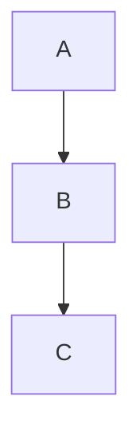
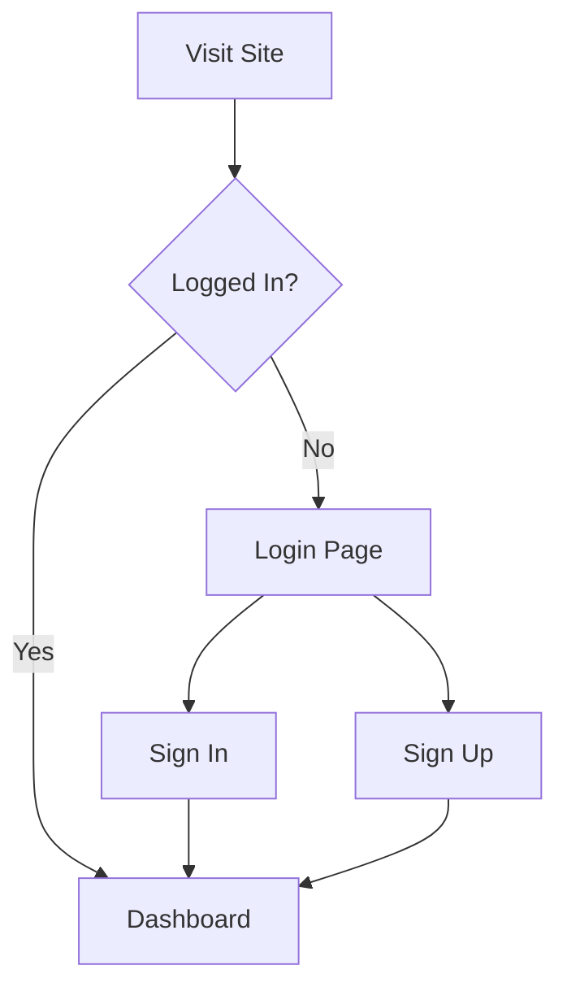

# Diagram

Renders diagrams from code blocks using Mermaid.js. The code block content is rendered as an SVG diagram in the browser.

````markdoc



````

### Example





### Attributes

| Attribute | Type | Default | Description |
|-----------|------|---------|-------------|
| `language` | `string` | `mermaid` | Diagram language: `mermaid`, `plantuml`, or `ascii` |
| `title` | `string` | — | Accessible title for the diagram |
