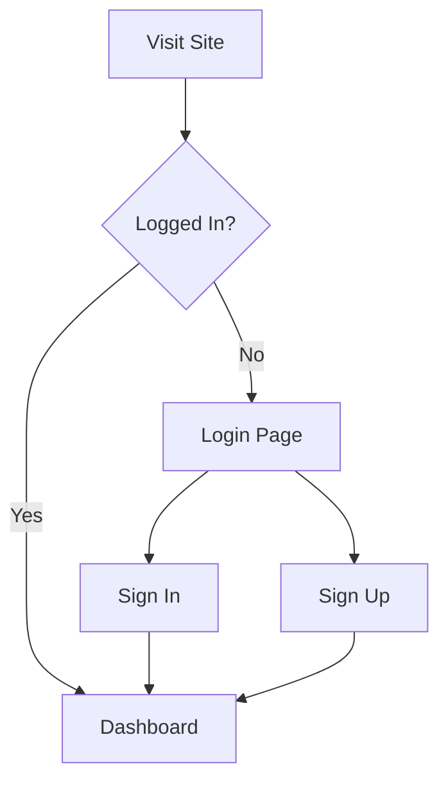

# Diagram

Renders diagrams from code blocks using Mermaid.js. The code block content is rendered as an SVG diagram in the browser.

## Basic usage

Wrap a Mermaid code block with the diagram rune to render it as an SVG.





```mermaid
graph TD
  A[Visit Site] --> B{Logged In?}
  B -->|Yes| C[Dashboard]
  B -->|No| D[Login Page]
  D --> E[Sign Up]
  D --> F[Sign In]
  F --> C
  E --> C
```




### Attributes

| Attribute | Type | Default | Description |
|-----------|------|---------|-------------|
| `language` | `string` | `mermaid` | Diagram language: `mermaid`, `plantuml`, or `ascii` |
| `title` | `string` | — | Accessible title for the diagram |

### Common attributes

All block runes share these attributes for layout and theming.

| Attribute | Type | Default | Description |
|-----------|------|---------|-------------|
| `width` | `string` | `content` | Page grid width: `content`, `wide`, or `full` |
| `spacing` | `string` | — | Vertical spacing: `flush`, `tight`, `default`, `loose`, or `breathe` |
| `inset` | `string` | — | Horizontal padding: `flush`, `tight`, `default`, `loose`, or `breathe` |
| `tint` | `string` | — | Named colour tint from theme configuration |
| `tint-mode` | `string` | `auto` | Colour scheme override: `auto`, `dark`, or `light` |
| `bg` | `string` | — | Named background preset from theme configuration |
