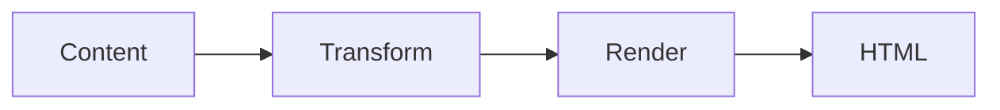

# Architecture card

A `` in a card's media zone is an architecture card: the rendered diagram fills the media well, a caption sits below. The diagram is static SVG, so it's a presentational guest with no interaction caveats.








---

### Pipeline at a glance
Four stages, content to output.




## How it works

The diagram renders to inline SVG, then the media-zone contract sizes it to the card's media well. No `href` caveats apply — a diagram is non-interactive, so it composes the same whether or not the card links.

## See also

- [card](/runes/card) · [diagram](/runes/diagram)
- [Composability contract](/extend/rune-authoring/composability)
