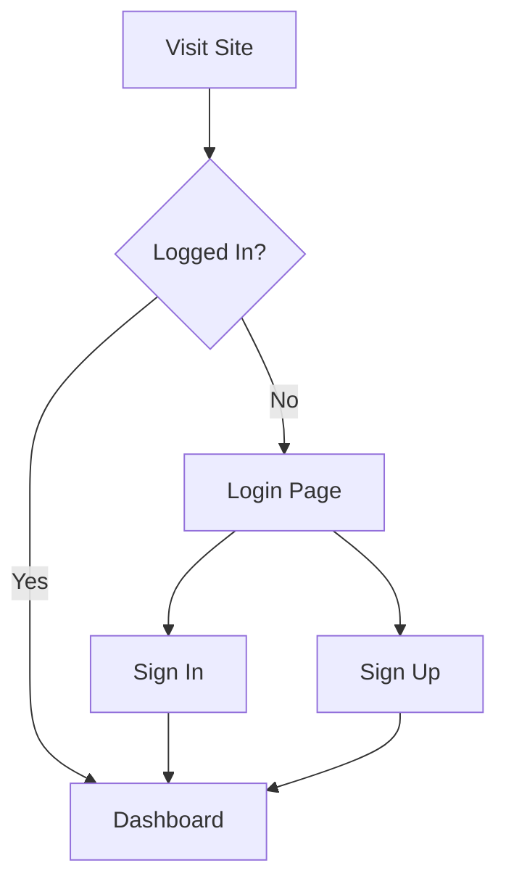

# Diagram

Renders diagrams from code blocks using Mermaid.js. The code block content is rendered as an SVG diagram in the browser.

## Basic usage

Wrap a Mermaid code block with the diagram rune to render it as an SVG.









### Attributes



