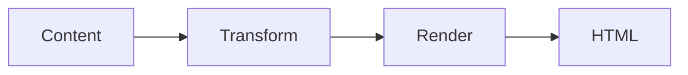

# Media guests

An open container — a `card`, a `bento` cell, a `feature` — adapts its **slot** to whatever rune you drop in, name-agnostically; the guest just fills it. There's no per-guest CSS and no bespoke "chart card" or "map card" rune — a designed tile is a plain container fed a guest.

The container's leading zone (before the first `---`) is its **media zone**, and the media-zone contract sizes, clips, and centres any guest that lands there. This page catalogues the patterns. For *how* the contract works — the open-world model, when a guest opts out of the clip, the interaction-posture rule — see the [Composability contract](/extend/rune-authoring/composability). To decorate the surface *around* the guest (frame, cover, tint, gradient), see [Surfaces](/runes/surfaces).

## Visual data guests

A chart, diagram, or map needs no wrapper — the slot sizes it; a title sits below the `---`, or overlays it in a cover poster.

### Metric card

A `` fills the media well; the same plain `card`, only the guest changed.





| Quarter | Revenue |
|---------|---------|
| Q1 | 4200 |
| Q2 | 5100 |
| Q3 | 4800 |
| Q4 | 6200 |


---

### Quarterly revenue
Up 14% on the year.




Drop the same chart into a `bento` cell and you get a [dashboard grid](#dashboard-grid) — same guest, different container.

### Architecture card

A `` renders to inline SVG, then the slot sizes it. It's non-interactive, so it composes the same whether or not the card links.








---

### Pipeline at a glance
Four stages, content to output.




### Location card

A `` as a cover poster: it fills the card and a title overlays it. This card is a *linked cover*, so the map is an inert backdrop — the whole poster is one click target (see *Interactive guests & posture*, below). Drop the same map into a plain card and it pans and zooms.





- **Paris** - *Demoted to a backdrop* - 48.8566, 2.3522


---

### A linked location poster
The map would normally pan and zoom; inside a linked cover card its controls go silent, so the whole surface stays a single click target.




### Dashboard grid

The same chart guest, repeated across ``s. A bento cell adopts `card`'s zone contract — content splits on `---` into media / body / footer — so a chart in the leading zone is a media guest exactly as in the metric card. Uniform row tracks keep the tiles aligned.







| Month | Revenue |
|-------|---------|
| Jan | 4200 |
| Feb | 5100 |
| Mar | 4800 |
| Apr | 6200 |


---

### Revenue
Up 14% on the quarter.




| Week | Signups |
|------|---------|
| W1 | 120 |
| W2 | 180 |
| W3 | 240 |
| W4 | 360 |


---

### Signups
Trending up week over week.






## Code & comparison

### Code-sample card

A `` in the media zone is a tabbed snippet with a title below — here dressed with a displaced frame over a `substrate` fill (the chrome itself is documented in [Surfaces](/runes/surfaces#chrome--shadow-and-frame)). With no `href` the tabs stay interactive.





```ts
import { defineConfig } from '@refrakt-md/cli';
import marketing from '@refrakt-md/marketing';
import learning from '@refrakt-md/learning';
import storytelling from '@refrakt-md/storytelling';

export default defineConfig({
  content: './content',
  theme: '@refrakt-md/lumina',
  plugins: [
    marketing(),
    learning(),
    storytelling(),
  ],
  surfaces: {
    card: {
      elevation: 'md',
      frame: { aspect: '16/9' },
    },
    figure: {
      frame: { shadow: 'lg', anchor: 'top' },
    },
  },
});
```


---

### Codegroup over a substrate
The codegroup oversizes and displaces toward the bottom-right; the cross substrate fills the media slot beneath and shows through the strip the codegroup no longer covers.




### Comparison card

A `` is a draggable before/after; the two panels are its `---` split and hold *anything* — two images for a photo comparison, or two `sandbox`es with opposite `tint-mode` for a live light/dark view.







---




---

### Same tree, two seasons
Drag the divider to flip between July and February.











---





---

### Profile card, both modes
The shared `profile-card` example — left panel pinned to light, right to dark.




Juxtapose opts out of the slot's clip and container query so its slider chrome sizes to its own panels — but it keeps the slot's rounded corners and drops its own border/background/radius for the slot's media radius, so it reads as one surface, not two (the same double-chrome resolution `chart` and `diagram` use).

## Device & presentation

### Mockup

A `` (with a `` inside) is a media guest like any other — a single product tile in a card, or a multi-device gallery in a bento. Mockup is *intrinsically responsive*: its chrome and content scale via container queries (`cqi`) against the slot, so no `frame-aspect` is needed.








---

### Acme landing page
The production homepage, framed in browser chrome for the docs.













---

### Desktop
The full three-up metrics view, with the avatar in the top bar.







---

### Mobile
The same metrics stacked as a single column.






The sandbox sources live in [`site/examples/`](/runes/sandbox#examples-directory) — Tailwind `dark:` variants flow with the preview's theme toggle, which rebuilds each iframe with the new scheme baked into its srcdoc.

### Live program

The media zone holds a *running program* just as readily as an image. A `` is a media guest, so a live three.js scene drops into a card and animates in place — three.js imported straight from a CDN inside the sandbox, no build step and no plugin. It honours `prefers-reduced-motion` (holding a single static frame) and falls back to a poster if the CDN is unreachable.






---

### A live WebGL scene
In a plain card the scene animates; a linked or cover card would demote it to a still backdrop, like any other interactive guest.




## Interactive guests & posture

Most guests are presentational, but some are interactive — a `map`, a `codegroup`, a `juxtapose`, a `sandbox`. Whether they stay live depends on the host:

- In a **plain** card or cell (no `href`, not cover), an interactive guest stays fully interactive — the slider drags, the tabs switch, a map pans. The Code-sample, Comparison, and Mockup examples above all rely on this.
- A **linked** card (`href`) is one click target, so its media guest is **demoted** to a static fallback (`pointer-events: none`) and the click lands on the card.
- In **cover** mode the guest is always an inert backdrop — the Location poster above is exactly this: a linked cover whose map is demoted.

The demotion is scoped to the media zone only — a button or link in the body/footer stays live. The full model is the [media-guest interaction posture](/extend/rune-authoring/composability#media-guest-interaction-posture) contract.

## More guests

Any visual rune follows the same contract — `gallery`, `embed`, `audio`/`playlist`, design `swatch`/`palette`, `timeline` — and joins this page as it's verified. Two further composition families will arrive as their own pages under Essentials: **registry-fed** (`collection`/`aggregate`) and **layout signatures** (`bento`/`showcase` grids).

## See also

- [Composability contract](/extend/rune-authoring/composability) — the open-world model and interaction posture behind every pattern here.
- [Surfaces](/runes/surfaces) — decorating the surface *around* the guest: frame, cover, tint, gradient.
- [card](/runes/card) · [bento](/runes/marketing/bento) — the common host containers.
